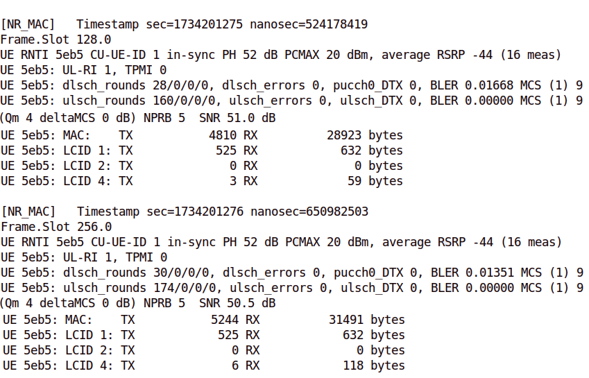

# oai_timestamps

Folder **OAI_patch** contains the patch to be applied to gNB scheduler.c, located
in the openair2/LAYER2/NR_MAC_gNB folder

After applying the patch and rebuilding the nr-softmodem executable timestamps are included in every 128 frame report
The following screen shot displays the gNB log output with the inclusion of timestamps on every frame report

To apply the patch copy file **timestamps.patch** from **OAI_patch** folder to **openairinterface5g/openair2/LAYER2/NR_MAC_gNB** folder
and run the command **patch < timestamps.patch**

Folder **scripts** contains the scripts that read gnb log files and draw the execution speed ratios.

